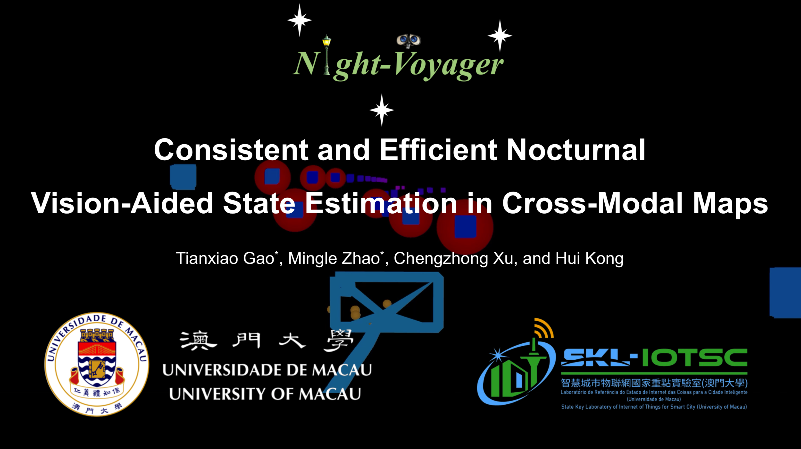
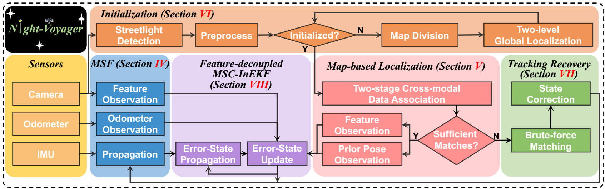

<div align="center">
  
# Night-Voyager: Consistent and Efficient Nocturnal Vision-Aided State Estimation in Object Maps

<a href="https://ieeexplore.ieee.org/document/10914553"></a>
<a href="https://arxiv.org/abs/2502.20054"></a>
<a href="https://www.youtube.com/watch?v=x7XtC_ALz80"></a>
<a href="https://pan.baidu.com/s/1vgTCHH3kppxkb1PW5Y8vNg?pwd=r2v4"></a>
<a href="https://github.com/IMRL/Night-Voyager/tree/main/supp"></a>

</div>

[](https://youtu.be/x7XtC_ALz80 "Night-Voyager: Consistent and Efficient Nocturnal Vision-Aided State Estimation in Object Maps")

## News
- **2025-03-02**: The code and the collected nighttime dataset are released!
- **2025-02-18**: Our paper is accepted by T-RO 2025!

## 1. Introduction
**Night-Voyager** is a consistent and efficient framework that harnesses rare object-level information from streetlight maps to fundamentally resolve the insufficiency and inconsistency bottlenecks inherent in nocturnal visual tasks, achieving robust and versatile nocturnal vision-aided state estimation in object maps.


## 2. Dataset
The collected nighttime dataset ([**Night-Voyager Dataset**](https://pan.baidu.com/s/1vgTCHH3kppxkb1PW5Y8vNg?pwd=r2v4)) is also available online. Each scenario in the dataset comprises two sets: one for constructing the streetlight map and the other for evaluating the algorithms. The streetlight detections are recorded in a separate folder. Additionally, we also leverage the nighttime sequences of the public [**MCD Dataset**](https://mcdviral.github.io/) for evaluation.

## 3. Prerequisites
### 3.1. Ubuntu and ROS
Ubuntu 18.04.

ROS Melodic, please follow [ROS Installation](http://wiki.ros.org/ROS/Installation).

### 3.2. PCL, OpenCV, and Eigen
PCL 1.8, please follow [PCL Installation](https://pointclouds.org/downloads/).

OpenCV 3.2.0, please follow [OpenCV Installation](http://opencv.org/).

Eigen 3.3.4, please follow [Eigen Installation](http://eigen.tuxfamily.org/index.php?title=Main_Page).

## 4. Build
Clone the repository and catkin_make:
```
mkdir -p ws_Night_Voyager/src
cd ~/ws_Night_Voyager/src
git clone https://github.com/IMRL/Night-Voyager.git
cd ../
catkin_make
source ~/ws_Night_Voyager/devel/setup.bash
```

## 6. Run
Download our collected rosbag files via Baidu NetDisk ([**Night-Voyager Dataset**](https://pan.baidu.com/s/1vgTCHH3kppxkb1PW5Y8vNg?pwd=r2v4)). Since the rosbag play node has been written in the launch files, please modify the paths of the downloaded rosbag files in the launch files (located in the launch subdirectory).
```
roslaunch night_voyager Scene_01.launch
```

## 7. Citation
If you find our work beneficial to your research, you may consider citing:

```
@inproceedings{gao2024night,
  title={Night-Rider: Nocturnal Vision-aided Localization in Streetlight Maps Using Invariant Extended Kalman Filtering},
  author={Gao, Tianxiao and Zhao, Mingle and Xu, Chengzhong and Kong, Hui},
  booktitle={2024 IEEE International Conference on Robotics and Automation (ICRA)},
  pages={10238--10244},
  year={2024},
  organization={IEEE}
}
```
```
@ARTICLE{10914553,
  author={Gao, Tianxiao and Zhao, Mingle and Xu, Chengzhong and Kong, Hui},
  journal={IEEE Transactions on Robotics}, 
  title={Night-Voyager: Consistent and Efficient Nocturnal Vision-Aided State Estimation in Object Maps}, 
  year={2025},
  volume={},
  number={},
  pages={1-20},
  keywords={State estimation;Visualization;Location awareness;Lighting;Robots;Cameras;Accuracy;Feature extraction;Standards;Robot vision systems;Localization;SLAM;Sensor Fusion;State Estimation;Object Map},
  doi={10.1109/TRO.2025.3548540}
}
```
## 8. Acknowledgement
The code references the implementation of the [P3P solver](https://github.com/yaqding/P3P?tab=readme-ov-file) and [OpenVINS](https://github.com/username/project). We thank the authors for their fantastic work!

## 9. License
The source code of this package is released under the [**GPLv2**](http://www.gnu.org/licenses/) license. For commercial use, please contact me at <ga0.tianxiao@connect.um.edu.mo> or Mingle Zhao at <zhao.mingle@connect.um.edu.mo> to discuss an alternative license.
