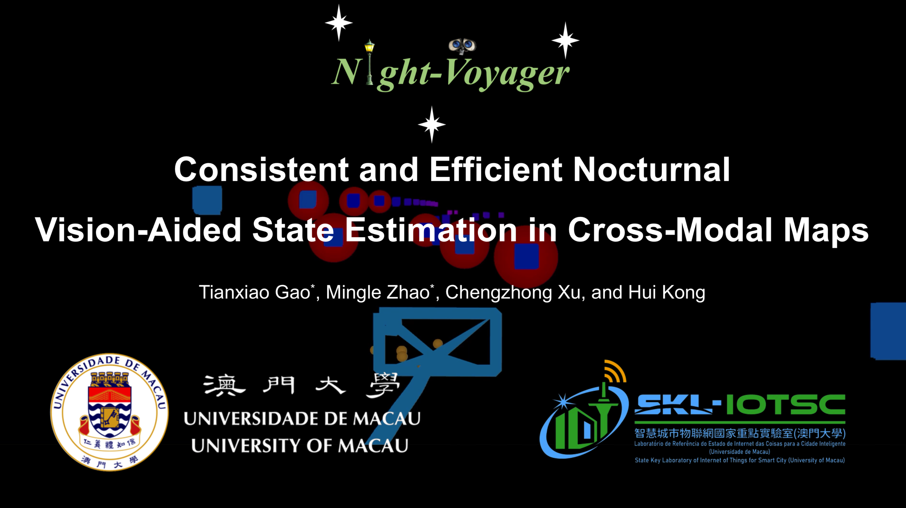

# Night-Voyager

# Reference:
Tianxiao Gao, Mingle Zhao, Chengzhong Xu, and Hui Kong, Night-Voyager: Consistent and Efficient Nocturnal Vision-Aided State Estimation in Cross-Modal Maps, under review, 2024
