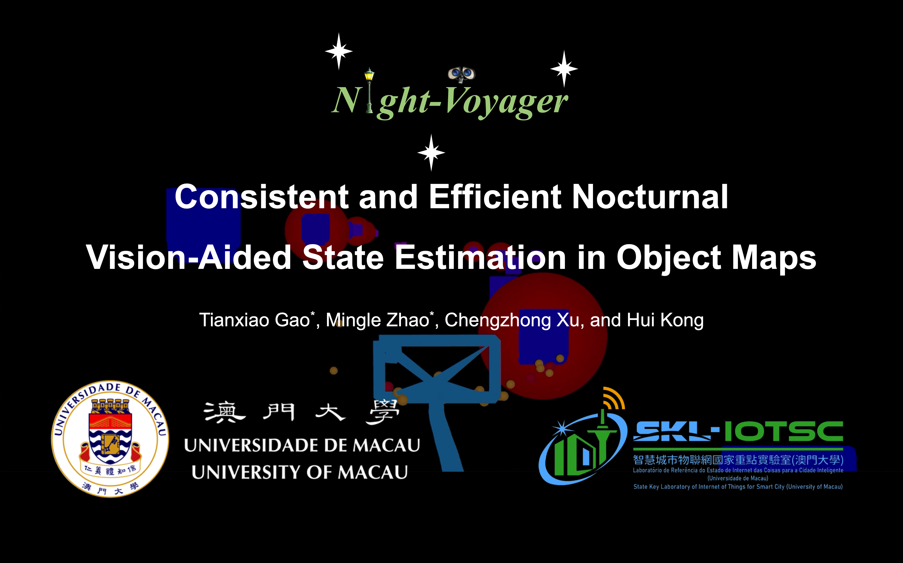
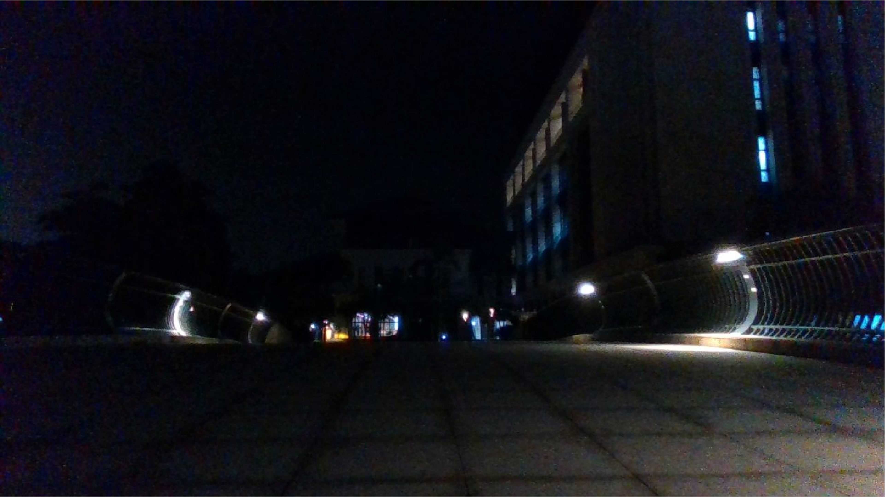

<div align="center">
  
# Night-Voyager: Consistent and Efficient Nocturnal Vision-Aided State Estimation in Object Maps

<a href="https://ieeexplore.ieee.org/document/10914553"></a>
<a href="https://arxiv.org/abs/2502.20054"></a>
<a href="https://www.youtube.com/watch?v=x7XtC_ALz80"></a>
<a href="https://pan.baidu.com/s/1vgTCHH3kppxkb1PW5Y8vNg?pwd=r2v4"></a>
<a href="https://github.com/IMRL/Night-Voyager/tree/main/supp"></a>

</div>

[](https://youtu.be/x7XtC_ALz80 "Night-Voyager: Consistent and Efficient Nocturnal Vision-Aided State Estimation in Object Maps")

## News
- **2025-03-02**: The code and the collected nighttime dataset are released!
- **2025-02-18**: Our paper is accepted by IEEE T-RO 2025!

## 1. Introduction
**Night-Voyager** is a consistent and efficient framework that harnesses rare object-level information from streetlight maps to fundamentally resolve the insufficiency and inconsistency bottlenecks inherent in nocturnal visual tasks, achieving robust and versatile nocturnal vision-aided state estimation in object maps.


## 2. Dataset
The collected nighttime dataset ([**Night-Voyager Dataset**](https://pan.baidu.com/s/1vgTCHH3kppxkb1PW5Y8vNg?pwd=r2v4)) is also available online. Each scenario in the dataset comprises two sets: one for constructing the streetlight map and the other for evaluating the algorithms. The streetlight detections are recorded in a separate folder and the constructed streetlight maps are placed in another folder. Additionally, we also leverage the nighttime sequences of the public [**MCD Dataset**](https://mcdviral.github.io/) for evaluation.

## 3. Prerequisites
### 3.1. Ubuntu and ROS
Ubuntu 18.04.

ROS Melodic, please follow [ROS Installation](http://wiki.ros.org/ROS/Installation).

### 3.2. PCL, OpenCV, and Eigen
PCL 1.8, please follow [PCL Installation](https://pointclouds.org/downloads/).

OpenCV 3.2.0, please follow [OpenCV Installation](http://opencv.org/).

Eigen 3.3.4, please follow [Eigen Installation](http://eigen.tuxfamily.org/index.php?title=Main_Page).

## 4. Build
Clone the repository and catkin_make:
```
mkdir -p ws_Night_Voyager/src
cd ~/ws_Night_Voyager/src
git clone https://github.com/IMRL/Night-Voyager.git
cd ../
# Maybe need to compile twice for custom ROS messages
catkin_make && catkin_make
source ~/ws_Night_Voyager/devel/setup.bash
```

## 5. Run
Download our collected rosbag files via Baidu NetDisk ([**Night-Voyager Dataset**](https://pan.baidu.com/s/1vgTCHH3kppxkb1PW5Y8vNg?pwd=r2v4)). Since the ROS bag playback node is already included in the launch files, please update the file paths in the launch files (located in the launch subdirectory) to match the downloaded ROS bag files. Additionally, by modifying the "scene_name" parameter, you can test Night-Voyager with the corresponding sequence.
```
roslaunch night_voyager night_voyager.launch
```

The characters of each equence are summarized in the following table:
| <font size="2.5">**Sequence**</font> | <font size="2.5">**Distance**</font> | <font size="2.5">**Scene**</font>  | <font size="2.5">**Distribution**</font> | <font size="2.5">**Preview**</font> | <font size="2.5">**Map**</font> |
|:------------:|:----------------:|:---------------:|:----------------:|:-----------:|:-------:|
| <font size="2">_Scene_01_</font>   | <font size="2">724 m</font>              | <font size="2">Avenue & Garden</font> | <font size="2">Sparse</font>           |     |  |
| <font size="2">_Scene_02_</font>   | <font size="2">613 m</font>              | <font size="2">Lane</font>            | <font size="2">Dense</font>            |     |  |
| <font size="2">_Scene_03_</font>   | <font size="2">635 m</font>              | <font size="2">Lane & Pavement</font> | <font size="2">Sparse</font>           |     |  |
| <font size="2">_Scene_04_</font>   | <font size="2">305 m</font>              | <font size="2">Garden</font>          | <font size="2">Sparse</font>           |     |  |
| <font size="2">_Scene_05_</font>   | <font size="2">777 m</font>              | <font size="2">Seaside Road</font>    | <font size="2">Dense</font>            |     |  |
| <font size="2">_Scene_06_</font>   | <font size="2">1071 m</font>             | <font size="2">Seaside Road</font>    | <font size="2">Dense</font>            |     |  |
| <font size="2">_Scene_07_</font>   | <font size="2">892 m</font>              | <font size="2">Avenue & Garden</font> | <font size="2">Mixed</font>            |     |  |
| <font size="2">_Scene_08_</font>   | <font size="2">719 m</font>              | <font size="2">Alley & Campus</font>  | <font size="2">Mixed</font>            |     |  |
| <font size="2">_Scene_09_</font>   | <font size="2">842 m</font>              | <font size="2">Campus</font>          | <font size="2">Mixed</font>            |     |  |
| <font size="2">_Scene_10_</font>   | <font size="2">601 m</font>              | <font size="2">Bridge & Avenue</font> | <font size="2">Mixed</font>            |     |  |

## 6. Citation
If you find our work beneficial to your research, you may consider citing:

```
@inproceedings{gao2024night,
  title={Night-Rider: Nocturnal Vision-aided Localization in Streetlight Maps Using Invariant Extended Kalman Filtering},
  author={Gao, Tianxiao and Zhao, Mingle and Xu, Chengzhong and Kong, Hui},
  booktitle={2024 IEEE International Conference on Robotics and Automation (ICRA)},
  pages={10238--10244},
  year={2024},
  organization={IEEE}
}
```
```
@ARTICLE{10914553,
  author={Gao, Tianxiao and Zhao, Mingle and Xu, Chengzhong and Kong, Hui},
  journal={IEEE Transactions on Robotics}, 
  title={Night-Voyager: Consistent and Efficient Nocturnal Vision-Aided State Estimation in Object Maps}, 
  year={2025},
  volume={},
  number={},
  pages={1-20},
  keywords={State estimation;Visualization;Location awareness;Lighting;Robots;Cameras;Accuracy;Feature extraction;Standards;Robot vision systems;Localization;SLAM;Sensor Fusion;State Estimation;Object Map},
  doi={10.1109/TRO.2025.3548540}
}
```
## 7. Acknowledgement
The code references the implementation of the [P3P solver](https://github.com/yaqding/P3P?tab=readme-ov-file) and [OpenVINS](https://github.com/username/project). We thank the authors for their fantastic works!

## 8. Contact
- For technical issues and support, please contact Tianxiao Gao at <ga0.tianxiao@connect.um.edu.mo> or Mingle Zhao at <zhao.mingle@connect.um.edu.mo>.
- For commercial use, please contact Prof. Hui Kong at <huikong@um.edu.mo>.
